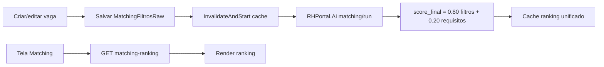
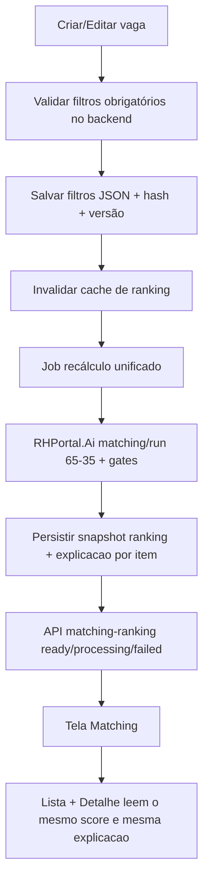

# Plano de evolução do Matching Vetorial (65/35)

Data: 03/03/2026  
Escopo: `Vagas` + `Matching` (Next, RHPortal.Api, RHPortal.Ai)  
Objetivo: tornar o score mais criterioso, previsível e consistente entre ranking e detalhe.

---

## 1) Objetivo de negócio

- Reduzir falsos positivos de aderência alta (ex.: 95-100 sem evidência técnica forte).
- Tornar o `100%` raro e justificável.
- Garantir que a vaga não exista sem filtros de matching válidos.
- Garantir recálculo completo (ranking vetorial + score) sempre que filtros mudarem.
- Ter uma fonte única de verdade para score e explicação (evitar divergência entre tela e backend).

---

## 2) Como está hoje (AS-IS)

### Arquitetura atual

- `LioTecnica.Web.Next`:
  - `VagasScreen` abre `Matching` por `vagaId`.
  - `MatchingScreen` consome:
    - `GET /api/vagas/{id}` (detalhes e requisitos)
    - `GET /api/vagas/{id}/matching-ranking` (ranking unificado em cache)
  - Modal "Editar filtros de matching" lê/escreve `matchingFiltrosRaw` via `PATCH`.
- `RHPortal.Api`:
  - `VagasController.GetMatchingRanking` consulta cache unificado.
  - `VagaUnifiedMatchingCacheService` invalida e dispara recálculo em background.
  - `VagaService` já invalida cache quando `matchingFiltrosRaw` muda.
- `RHPortal.Ai`:
  - Pipeline unificado: vetorial + LLM com composição `80% filtros + 20% requisitos`.

### Fluxo atual (resumido)



### Pontos fortes atuais

- Já existe recálculo em background por mudança de filtros.
- Já existe cache com status (`processing`, `ready`, `failed`) e stale data.
- Fluxo de edição de filtros na tela já está integrado com `PATCH`.

---

## 3) Gaps identificados

1. **Score ainda permissivo para topo**
   - Com `80/20`, candidatos com bom contexto de filtro podem inflar `score_final` mesmo com lacunas técnicas.

2. **Regra de aprovação pouco rígida**
   - Dependência excessiva de score agregado sem travas de qualidade para obrigatórios.

3. **Criação sem filtro obrigatório no backend**
   - Hoje a obrigatoriedade está no frontend de criação; precisa virar invariante de API também.

4. **`matchingFiltrosRaw` como texto livre**
   - Fácil perder semântica, difícil validar/versão/auditar.

5. **Risco de divergência de leitura de score**
   - Ranking vem de IA, detalhe pode sofrer deriva se houver cálculo local ou parsing imperfeito.

---

## 4) Como deve ficar (TO-BE)

### 4.1 Regra de score mais criteriosa

Nova composição:

- `score_final = 0.65 * score_filtros + 0.35 * score_requisitos`

Regras adicionais (gates) para endurecer:

1. **Penalidade por obrigatório ausente**
   - `-20` por obrigatório faltante, limite `-60`.

2. **Teto por cobertura obrigatória**
   - Se cobertura de obrigatórios `< 100%`, score máximo `89`.
   - Se cobertura de obrigatórios `< 70%`, score máximo `79`.

3. **Regra para 100%**
   - Só permite `100` quando:
     - cobertura obrigatória = 100%
     - `score_filtros >= 95`
     - `score_requisitos >= 95`
     - sem penalidade aplicada.

4. **Faixa de decisão operacional**
   - `>= threshold`: Dentro
   - `< threshold`: Abaixo
   - `Reprovado`: estado de workflow, separado de score.

> Resultado esperado: muito mais difícil chegar a 100; score técnico passa a ter peso real no topo.

### 4.2 Filtros de matching obrigatórios por contrato

No backend (`CreateVaga` e `UpdateVaga` quando status em uso):

- Rejeitar (`400`) vaga com filtros vazios/inválidos.
- Validar formato e domínio dos campos.
- Persistir versão estruturada, não só texto livre.

### 4.3 Modelo de dados recomendado para filtros

Adicionar estrutura canônica:

- `matchingFiltrosJson` (novo, versionado)
- `matchingFiltrosRaw` (legado, opcional para exibição)
- `matchingFiltrosVersion` (ex.: `v1`)
- `matchingFiltrosHash` (hash para invalidar cache e rastrear recálculos)

Exemplo de shape:

```json
{
  "version": "v1",
  "modalidade": "Presencial",
  "senioridade": "Pleno",
  "escolaridade": "Superior",
  "formacaoArea": "Engenharia",
  "cidade": "Sao Paulo",
  "uf": "SP",
  "tempoExp": "3-5",
  "sexo": "",
  "pcd": "S",
  "idadeMin": 25,
  "idadeMax": 45,
  "requerCnh": true,
  "cnhCategoria": "B",
  "habilidades": ["sql", "python", "power bi"],
  "observacoes": "..."
}
```

### 4.4 Fonte única de verdade para score/explanação

- Ranking e painel de detalhe devem usar o mesmo artefato de avaliação da IA.
- Expor no backend um detalhamento por candidato:
  - cobertura obrigatórios
  - requisitos atendidos/faltantes
  - penalidades aplicadas
  - score_filtros, score_requisitos, score_final.

---

## 5) Desenho alvo (TO-BE)



---

## 6) Plano de implementação (fases)

## Fase 0 - Segurança funcional (rápida)

- Corrigir todos os pontos de tela para classificar `Dentro/Abaixo` por `threshold` da vaga.
- Remover qualquer fallback visual que induza leitura errada de `pass`.
- Entregável: comportamento consistente no frontend.

## Fase 1 - Endurecimento de score (IA)

- Alterar pesos no `RHPortal.Ai`:
  - de `80/20` para `65/35`.
- Implementar gates de rigor (penalidades e teto).
- Garantir testes unitários de cálculo (casos extremos).
- Entregável: novo score final com distribuição mais realista.

## Fase 2 - Invariantes de criação/edição de vaga

- Backend passa a exigir filtros válidos para criar vaga.
- Em update, validar consistência quando status requer matching ativo.
- Mensagens de erro claras (contrato API).
- Entregável: não existe vaga operacional sem filtros.

## Fase 3 - Canonicalização de filtros

- Introduzir `matchingFiltrosJson` + versionamento.
- `matchingFiltrosRaw` vira apenas representação legível.
- Parser único no backend para normalizar entrada.
- Entregável: robustez de recálculo e auditabilidade.

## Fase 4 - Fonte única score + explicação

- Novo endpoint de detalhe por item de ranking (ou expandir payload atual).
- Tela de detalhe usa payload oficial da IA, sem recálculo local divergente.
- Entregável: fim de inconsistência entre tabela e painel lateral.

## Fase 5 - Observabilidade e operação

- Métricas:
  - tempo de recálculo
  - taxa de falha
  - distribuição de score (P50/P90/P99)
  - % de candidatos >= threshold por vaga.
- Logs com `filtersHash`, `vagaId`, `tenantId`, versão de regra.
- Entregável: governança e diagnóstico rápido.

## Fase 6 - Rollout controlado

- Feature flag por tenant:
  - `matching_rule_version = v1_80_20 | v2_65_35_strict`.
- Comparativo de impacto por 1-2 semanas.
- Cutover gradual.
- Entregável: migração segura sem regressão silenciosa.

---

## 7) Critérios de aceite

- Vaga não pode ser criada sem filtros válidos (API e UI).
- Alterar filtros dispara recálculo unificado automaticamente.
- Ranking e detalhe mostram o mesmo score e a mesma justificativa.
- `100%` torna-se raro e condicionado a aderência completa.
- Sem regressão de performance perceptível na tela de matching.

---

## 8) Riscos e mitigação

- **Risco:** endurecer demais e derrubar funil.  
  **Mitigação:** feature flag + monitoramento de distribuição de score por tenant.

- **Risco:** mudança de contrato quebrar frontend legado.  
  **Mitigação:** manter `matchingFiltrosRaw` por compatibilidade durante transição.

- **Risco:** recálculo pesado em massa.  
  **Mitigação:** fila com throttle, processamento incremental e stale ranking.

---

## 9) Próximos passos sugeridos (ordem prática)

1. Implementar pesos `65/35` + gates no `RHPortal.Ai`.
2. Subir validação obrigatória de filtros no `RHPortal.Api`.
3. Adicionar `matchingFiltrosJson` e hash versionado.
4. Expor detalhe oficial de score para o frontend.
5. Habilitar feature flag por tenant e fazer rollout gradual.

