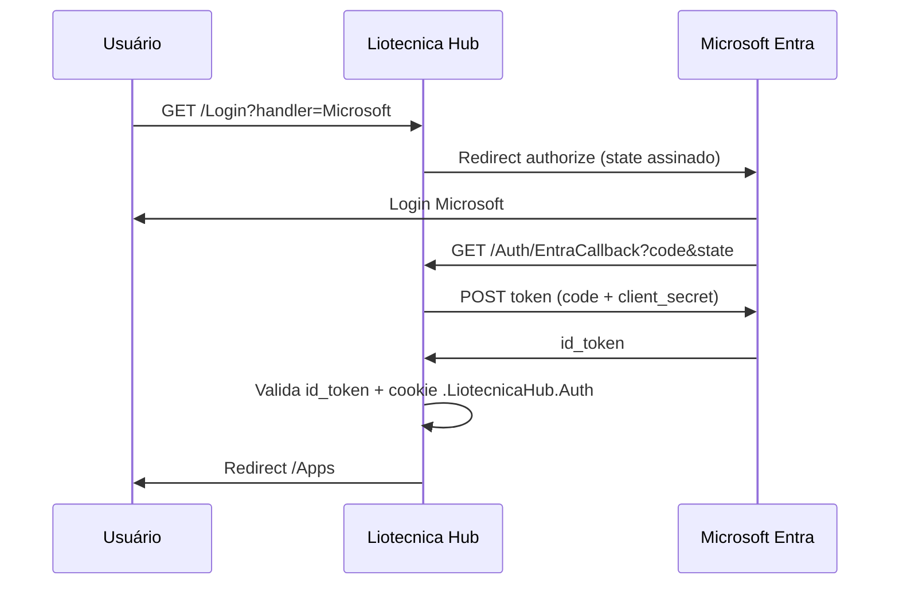

# Liotecnica Hub — Deploy e Azure AD

Guia completo para publicar o **Liotecnica Hub** (launcher corporativo com login Microsoft) e configurar o **Microsoft Entra ID** (Azure AD).

---

## Visão geral

O Hub é uma aplicação ASP.NET Core 8 (Razor Pages) que:

- Autentica usuários via **OAuth 2.0 Authorization Code** (Entra ID)
- Mantém sessão em cookie `.LiotecnicaHub.Auth`
- Exibe cards de aplicativos (ex.: Portal RH DEV/HML/PRD)
- Oferece painel admin para apps e configuração Entra (apenas e-mails em `HubAdmins`)

Porta padrão: **3010**.

---

## Pré-requisitos

| Item | Observação |
|------|------------|
| .NET 8 SDK | Desenvolvimento local |
| Docker + Compose | Deploy em container |
| PostgreSQL 14+ | Banco dedicado `liotecnica_hub` |
| App Registration no Entra ID | Permissões `openid`, `profile`, `email` |
| E-mails admin | Variável `HUB_SEED_ADMIN_EMAILS` |

---

## Variáveis de ambiente

Copie `docs/env.hub.example` para `.env.hub` na raiz do repositório.

| Variável | Descrição |
|----------|-----------|
| `ConnectionStrings__DefaultConnection` / `HUB_DB_CONNECTION` | Connection string PostgreSQL |
| `Hub__BaseUrl` / `HUB_BASE_URL` | URL pública do hub (ex.: `http://10.0.0.80:3010`) |
| `Hub__StateSigningKey` / `HUB_STATE_SIGNING_KEY` | Chave HMAC para `state` OAuth (≥ 32 caracteres) |
| `Hub__SeedAdminEmails` / `HUB_SEED_ADMIN_EMAILS` | E-mails admin separados por vírgula |
| `ASPNETCORE_URLS` | `http://+:3010` no container |

O **client secret** do Entra é salvo no banco via painel admin, criptografado com **ASP.NET Data Protection** (não vai em variável de ambiente).

---

## Deploy com Docker Compose

Na raiz do repositório:

```bash
cp docs/env.hub.example .env.hub
# Edite .env.hub (senha do Postgres, admins, URL pública)

docker compose -f docker-compose.hub.yml --env-file .env.hub up -d --build
```

Verifique:

```bash
curl http://localhost:3010/health
```

Na primeira subida, o app executa **migrations** e **seed** (3 apps Portal RH + config Entra vazia + admins).

---

## Deploy HMG (GitHub Actions)

Workflow: `.github/workflows/deploy-hub-hmg.yml`

1. Build e push da imagem `ghcr.io/<repo>/liotecnica-hub:<sha>`
2. Deploy via runner self-hosted `hmg-deploy` (mesma rede do servidor)

Secrets necessários (iguais ao deploy HMG do portal):

- `SSH_PRIVATE_KEY`
- `SSH_HOST`
- `SSH_USER`

Variables sugeridas:

- `HMG_HUB_BASE_URL` — ex.: `http://10.0.0.80:3010`
- `HMG_HUB_SEED_ADMIN_EMAILS`

No servidor, use `docker-compose.hub.yml` com imagem do GHCR e `.env.hub` apropriado.

---

## Configuração Microsoft Entra ID (Azure AD)

### 1. Registrar aplicativo

1. Acesse [portal.azure.com](https://portal.azure.com) → **Microsoft Entra ID** → **App registrations** → **New registration**
2. Nome: `Liotecnica Hub` (ou similar)
3. Supported account types: contas da organização (single tenant) ou conforme política
4. Redirect URI: **Web** → URL exata do callback:
   ```
   http://10.0.0.80:3010/Auth/EntraCallback
   ```
   (Ajuste host/porta para DEV/PRD; deve coincidir com `Hub__BaseUrl` + `/Auth/EntraCallback`)

### 2. Credenciais

1. Em **Certificates & secrets** → **New client secret**
2. Copie o valor (exibido uma vez)

### 3. IDs necessários

| Campo no Hub Admin | Onde encontrar no Azure |
|--------------------|-------------------------|
| Tenant ID | Overview do Entra / Directory (tenant) ID |
| Client ID | Overview da App Registration → Application (client) ID |
| Client Secret | Secrets criado no passo 2 |
| Redirect URI | Authentication → Redirect URIs (deve ser idêntico) |

### 4. Habilitar no Hub

1. Faça login como admin (e-mail em `HUB_SEED_ADMIN_EMAILS`)
2. **Admin** → **Microsoft Entra ID**
3. Preencha tenant, client id, secret, redirect URI e URL base
4. Marque **Habilitar login Microsoft** e salve
5. Teste em `/Login` → **Entrar com Microsoft**

### 5. Fluxo OAuth (resumo)



---

## Administradores

Admins são registros na tabela `HubAdmins`, criados no seed a partir de `HUB_SEED_ADMIN_EMAILS`.

A policy `HubAdmin` verifica o e-mail do cookie contra essa tabela em cada requisição à área `/Admin`.

Para adicionar admins em produção sem redeploy: insira na tabela ou inclua o e-mail na variável e reinicie (o seed só adiciona e-mails novos, não remove).

---

## Aplicativos seed (Portal RH)

| Ambiente | URL |
|----------|-----|
| DEV | `http://10.0.0.79:3000/app/login?tenant=liotecnica` |
| HML | `http://10.0.0.80:3000/app/login?tenant=liotecnica` |
| PRD | `http://10.0.0.88:3000/app/login?tenant=liotecnica` |

Edite em **Admin → Aplicativos** após o deploy.

---

## SSO Hub → Portal RH (login automático)

Quando o usuário clica em um card **Portal RH** no Hub, o fluxo usa **token HMAC** assinado (validade 60s):

```text
Hub /Apps/Launch/{id}
  → gera token (e-mail + tenant)
  → redirect GET /api/auth/hub-sso?token=...
  → API emite JWT do Portal
  → front /app/login#entra_token=... → /dashboard
```

### Chave compartilhada (obrigatório)

A **mesma** chave deve existir nos dois lados:

| Onde | Variável |
|------|----------|
| Hub | `Hub__StateSigningKey` / `HUB_STATE_SIGNING_KEY` |
| Portal RH API | `HubSso__SigningKey` (ver `docs/env.hmg.example`) |

No HMG, adicione em `~/.env.hmg` do servidor:

```env
HubSso__SigningKey=<mesmo valor do HUB_STATE_SIGNING_KEY do hub>
HubSso__Enabled=true
```

Reinicie a API (`docker compose ... up -d api`).

### URLs de launch

Os cards continuam com URL de login (`.../app/login?tenant=liotecnica`). O Hub detecta esse padrão e troca pelo SSO automaticamente.

### Erros no Portal

| Query | Significado |
|-------|-------------|
| `hub_sso_error=token_invalido` | Token expirou ou chave divergente |
| `hub_sso_error=usuario_nao_autenticado` | E-mail do Hub não existe no tenant |
| `hub_sso_error=nao_configurado` | `HubSso__SigningKey` ausente na API |

---

## Troubleshooting

| Sintoma | Causa provável | Ação |
|---------|----------------|------|
| Botão Microsoft desabilitado | Entra não habilitado ou sem client/tenant | Admin → Entra ID |
| `nao_configurado` | Redirect URI vazio | Preencher callback completo |
| `state_invalido` | `HUB_STATE_SIGNING_KEY` mudou ou expirou (>10 min) | Tentar de novo; manter chave estável |
| `troca_de_code_falhou` | Secret errado ou redirect URI diferente do Azure | Conferir secret e URI exata |
| Admin não aparece | E-mail não está em `HubAdmins` | Conferir seed / tabela |
| Health falha | Postgres inacessível | Connection string e rede |
| `/Login` HTTP 500 | Client secret Entra criptografado com chaves antigas após redeploy | Rodar `__scripts__/hmg/hub-fix-login-500.sh` no servidor; redeploy com volume `hub_dpkeys`; re-salvar secret no Admin |
| `secret_ausente` / `secret_invalido` | Client secret vazio ou errado no banco | Login administrativo (`HUB_ALLOW_DEV_LOGIN=true`) → **Configurações → Entra ID** → salvar **Value** do secret Azure |
| Sem opção Admin | Usuário não autenticado ou e-mail fora de `HUB_SEED_ADMIN_EMAILS` | Entrar com e-mail admin via login bootstrap; depois **Configurações** na sidebar ou `/Admin/EntraConfig` |
| Ícone sumiu após redeploy | Volume `hub_uploads` não montado | Confirmar `hub_uploads:/app/wwwroot/uploads` no compose |

---

## Checklist de go-live

- [ ] Postgres dedicado com backup
- [ ] `HUB_STATE_SIGNING_KEY` forte e persistido
- [ ] `HUB_BASE_URL` com host real acessível pelos usuários
- [ ] Redirect URI registrado no Azure = callback do hub
- [ ] Client secret salvo no admin
- [ ] Pelo menos um admin em `HUB_SEED_ADMIN_EMAILS`
- [ ] `/health` respondendo 200
- [ ] Teste login Microsoft e abertura dos 3 ambientes Portal RH
