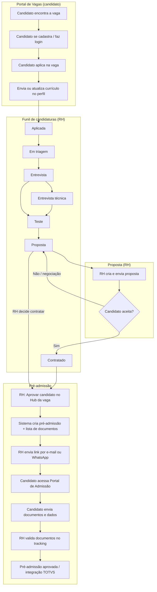
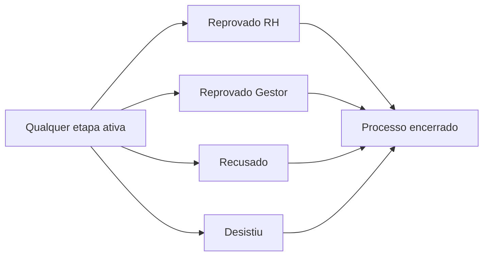
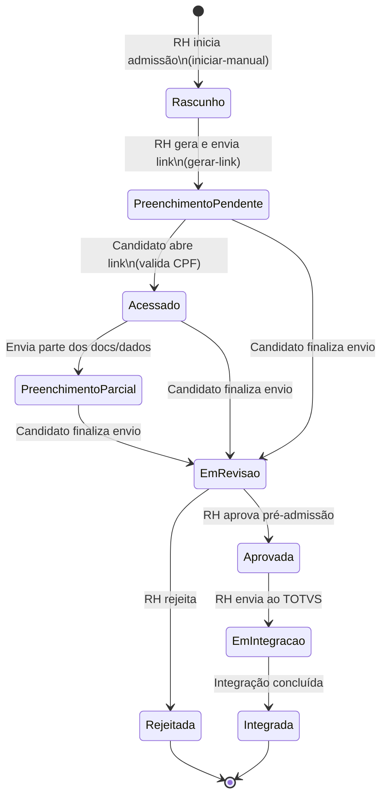

# Manual operacional — Da candidatura à pré-admissão

Guia passo a passo para **Analistas de RH** conduzirem um candidato desde a aplicação na vaga até a **pré-admissão** (coleta de documentos e dados para admissão).

**Público:** analista de RH, coordenador de recrutamento, gestor acompanhando o processo.  
**Ambiente de referência:** Portal RH (`/app`).

---

## Visão geral

O processo tem **duas grandes fases**:

1. **Recrutamento e seleção** — candidato percorre etapas no funil (kanban) até aceitar a proposta.
2. **Pré-admissão** — RH solicita documentação, candidato envia pelo portal público, RH valida e segue para integração.

```text
Portal de Vagas          Funil (Kanban)              Pré-admissão
───────────────          ───────────────             ─────────────
Candidato aplica    →    RH conduz etapas      →     RH envia link
                         até Proposta/Contratado      Candidato envia docs
                                                      RH revisa e aprova
```

---

## Pré-requisitos (antes de começar)

| Item | Onde conferir |
|------|----------------|
| Vaga **Aberta** e publicada | Recrutamento → Vagas → Hub da vaga |
| **Documentação padrão** configurada (RG, CPF, etc.) | Administração → Documentação Padrão |
| Candidato com **e-mail** e **celular** (obrigatório na aprovação) | Hub da vaga → editar candidato |
| Permissões de recrutamento e admissão | Perfil Analista de RH |

---

## Fluxograma 1 — Caminho feliz (candidatura → pré-admissão)



> **Nota:** Entrevista técnica e Teste são **opcionais** — o RH pode avançar direto conforme o processo da vaga. Nem toda vaga usa todas as colunas do kanban.

---

## Fluxograma 2 — Caminhos de saída do funil



Quando o candidato vai para uma coluna de **saída**, o processo seletivo **encerra** — não há pré-admissão nesse caminho.

---

## Fluxograma 3 — Detalhe da pré-admissão



**O que o candidato vê:** Portal de Admissão (`/DocumentoAdmissao`) — lista de documentos solicitados, upload de arquivos e formulário de dados.

**O que o RH vê:** Admissão → Pré-Admissão → abrir registro → **Tracking** (`/app/admissao/tracking/{id}`).

---

## Etapas do funil — o que fazer em cada uma

### 0. Antes de «Aplicada» — publicação e candidatura

| Quem | Ação | Onde |
|------|------|------|
| RH | Publica a vaga | Hub da vaga → Publicar |
| Candidato | Aplica e mantém currículo atualizado | Portal de Vagas (externo) |
| Sistema | Cria candidatura em **Aplicada** | Automático |

**Menu RH:** Recrutamento → Vagas → Hub → aba **Candidatos & Match**

---

### 1. Aplicada

**Significado:** candidato manifestou interesse; ainda não foi analisado pelo RH.

| Ação do RH | Como |
|------------|------|
| Calcular **match** com a vaga | Hub → Candidatos & Match → Calcular match |
| Ver **compatibilidade** e **análise IA** | Botões na linha do candidato |
| Conferir currículo | Visualizar / Baixar CV |
| Completar contato se faltar | ⋯ → Editar candidato **ou** ⋯ → Avisar candidato |
| Avançar no funil | Recrutamento → **Candidaturas** → arrastar para **Em triagem** |

**Avisar candidato:** solicita apenas **e-mail, celular ou telefone** no Portal de Vagas — **não** pede RG/CPF/comprovantes.

---

### 2. Em triagem

**Significado:** RH está avaliando aderência inicial (match, requisitos, currículo).

| Ação do RH | Como |
|------------|------|
| Registrar parecer | Observações no candidato / candidatura |
| Aprovar para entrevista | Kanban → **Entrevista** ou **Entrevista técnica** |
| Reprovar | Kanban → **Reprovado RH** / **Recusado** |

**Checklist antes de entrevista:** e-mail e celular preenchidos; match revisado; requisitos obrigatórios conferidos.

---

### 3. Entrevista / Entrevista técnica

**Significado:** etapas de avaliação presencial ou remota (com gestor, RH ou técnico).

| Ação do RH | Como |
|------------|------|
| Agendar e registrar feedback | Observações + mover no kanban |
| Aprovar | Avançar para **Teste** ou **Proposta** |
| Reprovar | **Reprovado RH**, **Reprovado Gestor** ou **Recusado** |

---

### 4. Teste

**Significado:** avaliação técnica, comportamental ou case (quando aplicável).

| Ação do RH | Como |
|------------|------|
| Registrar resultado | Observações |
| Aprovar | Kanban → **Proposta** |
| Reprovar | Colunas de saída |

---

### 5. Proposta

**Significado:** condições de contratação (salário, benefícios, data) sendo formalizadas.

| Ação do RH | Como |
|------------|------|
| Criar e enviar proposta | Recrutamento → **Propostas** (ou fluxo no hub) |
| Reenviar proposta | Hub → ⋯ → Reenviar proposta |
| Negociar / aguardar resposta | Manter em **Proposta** |
| Após aceite | Kanban → **Contratado** (opcional, mas recomendado) |
| **Iniciar pré-admissão** | Hub → ⋯ → **Aprovar candidato** |

> **Importante:** o botão **Aprovar candidato** só fica disponível com a candidatura na etapa **Proposta**. Não use antes de concluir entrevistas/testes.

---

### 6. Contratado

**Significado:** candidato aceitou; processo seletivo encerrado com sucesso. No portal do candidato aparece como *Em processo de admissão*.

| Ação do RH | Como |
|------------|------|
| Acompanhar admissão | Hub → ⋯ → **Acompanhar admissão** (abre wizard RH) |
| Ou reenviar link ao candidato | Hub → ⋯ → **Reenviar aprovação** / **Aprovar candidato** |

---

## Pré-admissão — passo a passo operacional

### Passo A — Configurar documentos (uma vez por tenant)

1. **Administração** → **Documentação Padrão**
2. Marcar cada tipo: **Obrigatório**, **Opcional** ou **Não será pedido**
3. Salvar global (há overrides por nível/cargo se necessário)

Documentos típicos CLT: RG, CPF, comprovante de residência, CTPS, título de eleitor, PIS, comprovante bancário, escolaridade, foto 3×4.

---

### Passo B — Disparar a coleta (a partir da vaga)

1. **Recrutamento** → **Vagas** → abrir vaga → **Candidatos & Match**
2. Localizar candidato em **Proposta** (ou já **Contratado**)
3. Confirmar **e-mail** e **celular**
4. Menu **⋯** → **Aprovar candidato**
5. Escolher tipo de contratação (**CLT** ou **PJ**)
6. Conferir lista de documentos exibida no modal
7. Enviar:
   - **Via WhatsApp**, ou
   - **Via E-mail**, ou
   - Preencher manualmente (RH preenche no wizard interno)

O sistema cria a **pré-admissão**, carrega os documentos da configuração padrão e gera o **link público**.

---

### Passo C — Acompanhar e ajustar (Admissão)

1. **Admissão** → **Pré-Admissão** → abrir o registro do candidato  
   **Ou** URL: `/app/admissao/tracking/{id}`

2. Seções disponíveis (status *Preenchimento Pendente*):

| Seção | Uso |
|-------|-----|
| **Solicitar Documentos** | Marcar/desmarcar tipos e obrigatoriedade → Salvar |
| **Link de Acesso** | Informar CPF → Gerar link → Copiar/reenviar |
| **Documentos recebidos** | Visualizar, aprovar ou rejeitar cada arquivo |
| **Dados do candidato** | Conferir informações enviadas |

3. Quando tudo estiver ok → **Aprovar** pré-admissão → seguir integração TOTVS (se aplicável).

---

### Passo D — Lado do candidato

1. Recebe link por e-mail ou WhatsApp
2. Abre **Portal de Admissão**
3. Informa **CPF** para entrar
4. Envia documentos (PDF, JPG ou PNG) e preenche dados
5. Finaliza — mensagem de sucesso; RH é notificado para revisar

---

## Mapa de telas (referência rápida)

| Objetivo | Menu / tela |
|----------|-------------|
| Ver candidatos da vaga | Recrutamento → Vagas → Hub → **Candidatos & Match** |
| Mover etapas no funil | Recrutamento → **Candidaturas** (kanban) |
| Gerenciar propostas | Recrutamento → **Propostas** |
| Configurar docs solicitados | Administração → **Documentação Padrão** |
| Lista de pré-admissões | Admissão → **Pré-Admissão** |
| Detalhe / validar docs | Admissão → Tracking do registro |
| Preencher admissão (RH) | Admissão → **Nova admissão** (wizard) |
| Portal do candidato (docs) | Link público → **Portal de Admissão** |

---

## Checklist — antes de cada marco

### Antes de sair de «Aplicada»

- [ ] Currículo disponível  
- [ ] Match calculado e revisado  
- [ ] Requisitos obrigatórios da vaga conferidos  

### Antes de «Entrevista»

- [ ] E-mail e celular preenchidos  
- [ ] Parecer de triagem registrado  

### Antes de «Proposta»

- [ ] Entrevista(s) concluída(s)  
- [ ] Teste concluído (se houver)  
- [ ] Alinhamento com gestor sobre condições  

### Antes de «Aprovar candidato» / pré-admissão

- [ ] Candidatura em **Proposta** (ou aceite formalizado)  
- [ ] Tipo de contratação definido (CLT/PJ)  
- [ ] E-mail e celular válidos  
- [ ] Documentação padrão configurada no admin  
- [ ] CPF coletado (necessário para gerar link com validação)  

### Antes de aprovar a pré-admissão (RH)

- [ ] Documentos obrigatórios recebidos e validados  
- [ ] Dados pessoais conferidos  
- [ ] Pendências comunicadas ao candidato (reenvio de link se necessário)  

---

## Erros comuns — o que evitar

| Situação | Por quê |
|----------|---------|
| Clicar **Aprovar candidato** logo após um bom match | Ação é de **admissão**, não de triagem — candidato ainda está cedo no funil |
| Esperar pedido de RG/CPF no kanban | Documentos formais só na **pré-admissão**, não nas etapas de seleção |
| Aprovar sem e-mail/celular | Sistema bloqueia ou impede envio do link |
| Não configurar Documentação Padrão | Sistema usa lista genérica de fallback — pode não refletir política da empresa |

---

## Resumo para conversa com PO / stakeholders

- O candidato **aplica no Portal de Vagas**; o RH conduz o funil até **Proposta**.
- A **coleta de documentação** (RG, CPF, comprovantes etc.) começa só na **pré-admissão**, após decisão de contratar.
- O RH dispara pelo **Hub da vaga** (*Aprovar candidato*); o candidato responde no **Portal de Admissão**.
- A lista de documentos vem da configuração em **Documentação Padrão** (global + overrides por cargo).
- Match e IA **apoiam a decisão**, mas a movimentação oficial é no **kanban de candidaturas** e nas telas de **proposta/pré-admissão**.

---

## Documentos relacionados

- [`docs/uat-pre-admissao-documentacao-candidato.md`](uat-pre-admissao-documentacao-candidato.md) — roteiro de teste UAT detalhado  
- [`docs/roteiro-rh-pos-match-candidato-vaga.md`](roteiro-rh-pos-match-candidato-vaga.md) — condução pós-match no hub da vaga  

---

*Última atualização: jun/2026 — fluxo conforme Portal RH (Next.js + API).*
